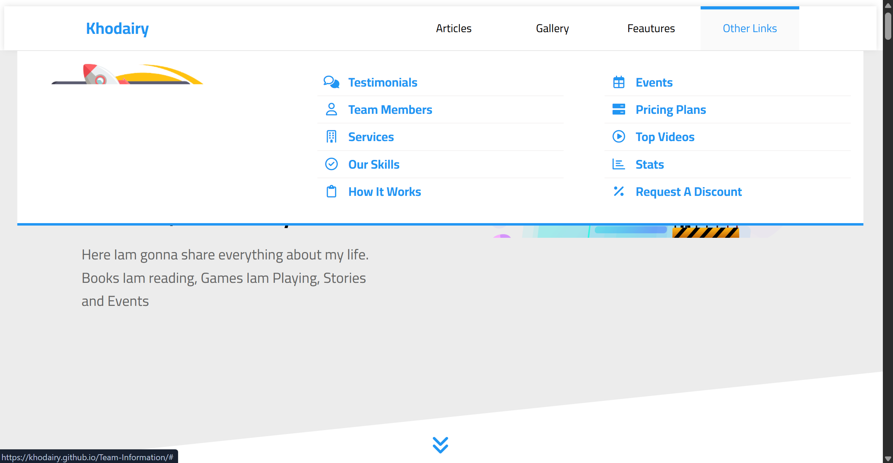

# 👥 TeamInfo - Dynamic Multi-Section Landing Page

A visually rich landing page built with **Pure HTML5** and **Pure CSS3**. This project highlights advanced layout techniques and sophisticated **CSS Animations** to create an engaging user experience without any external frameworks.

---

## 📸 Preview

[](https://abdallakhodairy-portfolio.netlify.app/images/teamInfo.png)

---

## 🌐 Live Demo

🔗 [Explore Live Project](https://khodairy.github.io/TeamInfo/) 
*(Note: Please ensure your live link is correct in the repository settings)*

---

## 📖 Project Description

TeamInfo is a comprehensive landing page designed to showcase detailed information about a team or organization. It features multiple high-impact sections, each designed with a focus on visual hierarchy and interactivity:
- **Core Sections**: Articles, Gallery, Features, and Team Members.
- **Social Proof**: Testimonials and Skills with progress indicators.
- **Service Details**: Services, How It Works, Events, and Pricing Plans.
- **Rich Media**: Top Videos, Stats, and a "Request A Discount" call-to-action.

---

## ✨ Key Features

- **Advanced CSS Animations**: Custom keyframe animations for headers, cards, and interactive elements.
- **Pure CSS Layout**: Heavy use of **CSS Grid** and **Flexbox** to organize 13+ complex sections.
- **Responsive Design**: Meticulously crafted to be fully responsive across all device types.
- **Component-Based Styling**: Organized CSS structure focusing on reusable UI patterns.

---

## 🎯 Project Goals

- Mastery of **CSS Keyframes** and transitions for smooth UI effects.
- Implementing complex sections like **Pricing Plans** and **Video Galleries** using semantic HTML.
- Deepening knowledge of **CSS Pseudo-elements** (`::before`, `::after`) for decorative designs.
- Maintaining clean, readable code in a large-scale single-page layout.

---

## 🛠 Tech Stack

- **HTML5**: Semantic structure for better accessibility.
- **CSS3**: Advanced properties, Grid, Flexbox, and Animations.
- **JavaScript**: Minimal logic for specific interactivity (if applicable).

---
## 🚀 Installation & Run Locally

1. **Clone the repository:**

```bash
git clone https://github.com/Khodairy/Team-Information.git
```

2. **Navigate to the directory:**

```bash
cd TeamInfo
```

3. **Open the project:**

Simply `open index.html` in your favorite browser.

Recommended: Use the Live Server extension in VS Code for the best experience.

---

## 📁 Project Structure

```text
TeamInfo/
├── css/                 # Main stylesheets and animation files
├── images/              # Assets and section screenshots
├── webfonts/            # Custom fonts and icon sets
├── index.html           # Main landing page
├── main.js              # Interactivity scripts
└── README.md            # Project documentation
```

---

## 👤 Author

**Abdallah Khodairy**

- Front-End Developer
- GitHub: [@Khodairy](https://github.com/Khodairy)
- LinkedIn: [LinkedIn](https://www.linkedin.com/in/abdallah-khodairy/)
- Portfolio: [Portfolio](https://abdallakhodairy-portfolio.netlify.app/)
